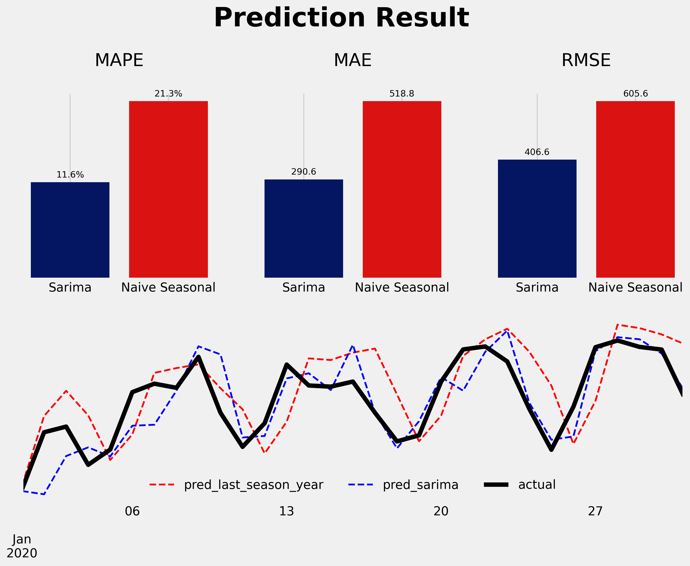

# Website Visitor Forecasting with SARIMA

This project forecasts website visitors using the Seasonal Autoregressive Integrated Moving Average (SARIMA) model. The data consists of daily unique visits to a website, and the model aims to predict future visits based on past data. The project also includes a baseline comparison using a naive seasonal prediction model.


## Usage

To run the forecast and generate the plots, execute the main script:
```sh
python main.py
```

## Functions

### test_adfuller

```python
def test_adfuller(array, array_name, alpha= 0.05):
    """
    Performs the Augmented Dickey-Fuller test to check for stationarity.

    Args:
        array (np.array): Array to test.
        array_name (string): Array name to display.
        alpha (float, optional): Significance level. Defaults to 0.05.
    """
```

### search_optimal_diff

```python
def search_optimal_diff(series, low= 0, high= 1):
    """
    Finds the number of differences needed to make the series stationary.

    Args:
        series (pd.Series): Time series data.
        low (int): Lower bound of differencing.
        high (int): Upper bound of differencing.
    """
```

### optimize_sarima

```python
def optimize_sarima(endog: pd.Series, ps: list, qs: list, d: int, Ps: list, Qs: list, D: int, s: int):
    """
    Finds the optimal SARIMA model parameters.

    Args:
        endog (pd.Series): Time series data.
        ps (list): List of AR orders to try.
        qs (list): List of MA orders to try.
        d (int): Integration order.
        Ps (list): List of seasonal AR orders to try.
        Qs (list): List of seasonal MA orders to try.
        D (int): Seasonal integration order.
        s (int): Length of seasonality.

    Returns:
        pd.DataFrame: DataFrame with combinations and their AIC values.
    """
```

### test_ljungbox

```python
def test_ljungbox(residuals):
    """
    Performs the Ljung-Box test for autocorrelation in residuals.

    Args:
        residuals (np.array): Model residuals.

    Returns:
        pd.DataFrame: DataFrame with Ljung-Box test results.
    """
```

### rolling_forecast

```python
def rolling_forecast(df: pd.DataFrame, col_name: str, train_len: int, horizon: int, window: int, method: str):
    """
    Performs rolling forecast using SARIMA or naive seasonal prediction.

    Args:
        df (pd.DataFrame): DataFrame containing the data.
        col_name (str): Column name for the target variable.
        train_len (int): Length of the training data.
        horizon (int): Forecast horizon.
        window (int): Window length for rolling forecast.
        method (str): Forecasting method ('sarima' or 'last_season_year').

    Returns:
        pd.Series: Series containing predictions.
    """
```

## Results

The prediction results are visualized using the following plot:


The SARIMA model outperforms the naive seasonal prediction model, as evidenced by lower MAPE, MAE, and RMSE scores.
